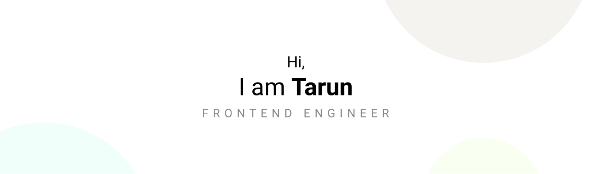

## Hey there  🌳 🧗‍♂️ ⛰️ 💻 🇮🇳

I'm a **Fronend Engineer** and I'm passionate about learning new **technologies**.

Always looking for a challenging new task with the opportunity to work with the latest technologies on challenging and diverse projects. 

I started my career as a web designer. I use to create User interfaces and branding. I use to convert those designs using HTML and JS. Slowly I realize that I was enjoying the coding part a lot and after getting in touch with React and Vue I completely shifted from being a designer to a Frontend developer. So mind works in both ways - designer and coder. 

I'm Indian and I'm currently living in **Udaipur, India** 🇮🇳 and actively participate in local and international community activities and events.

I love to code :computer:, travel ⛰️ and learn new things.

## My stack is as follows ⚡

* HTML, 
* CSS, 
* JavaScript, 
* TypeScript, 
* React, 
* Next.js, 
* React-Query,
* Vue

## Current situation ✨

- 🔭 I'm currently working as a frontend engineer @ <a href="https://gkmit.co/">GKMIT</a>
- 🌱 I'm currently focusing to get better at testing 🧪 and web accessibility 🦽

## How to reach me 📫

- E-mail: tarunkhandelwal@live.in
- Linkedin: https://www.linkedin.com/in/khandelwaltarun/
- Behance : https://www.behance.net/My_behance

<!--
**Delwalt/delwalt** is a ✨ _special_ ✨ repository because its `README.md` (this file) appears on your GitHub profile.

Here are some ideas to get you started:

- 🔭 I’m currently working on ...
- 🌱 I’m currently learning ...
- 👯 I’m looking to collaborate on ...
- 🤔 I’m looking for help with ...
- 💬 Ask me about ...
- 📫 How to reach me: ...
- 😄 Pronouns: ...
- ⚡ Fun fact: ...
-->
